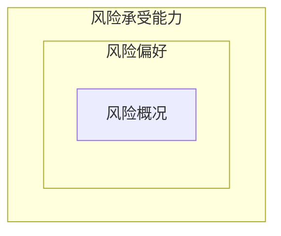

:::center
@startmindmap
caption 文章框架

* 公司风险管理
** 风险管理的动机
** 风险管理的五个方面
*** 识别风险与确定风险偏好
*** 匹配风险与选择策略
*** 细化风险偏好
*** 实施风险管理
*** 事后评估
** 风险对冲的问题讨论
*** 风险对冲的利弊
*** 风险对冲的挑战
@endmindmap
:::

## 风险管理的动机
- **公司有风险管理的需求**：公司在经营过程中面临着大宗商品价格波动、利率波动汇率波动以及对手方违约造成的风险
- **公司有风险管理的机会**：公司可采用的风险管理技术手段愈发丰富
## 风险管理的五个方面
### 识别风险与确定风险偏好
==风险偏好(risk appetite)==：一家公司愿意接受(willing to accept)的风险类型与风险水平，公司可通过风险偏好陈述书(risk appetite statement，RAS)来表达

==风险承受能力(risk capacity)==：公司能够承受的最大风险水平(maximum amount of rnisk)

==风险概况(risk profile)==：公司目前所承担(currently exposed)的风险水平

### 匹配风险与选择策略
==匹配风险(risk mapping)==：公司根据风险偏好中目标的风险水平，进行现金流及业务规划，并明确各项业务的风险敞口及现金流水平

**风险管理策略**
- ==风险保留(risk retain / keep)==：公司在其风险偏好内，选择保留一些发生可能性不大或者即便发生了损失也不大的风险事件
- ==风险回避(risk avoid)==：公司对于某些风险是“零容忍”的态度
- ==风险降低(risk mitigation)==：公司对于某些发生可能性较大，但如果发生了损失尚可的风险，通过增加抵押品等方式来降低风险
- ==风险转移(risk transfer)==：公司对于某些发生可能性很小，但是一旦发生就会带来巨大损失的风险，采用保险或者衍生品进行转移
### 细化风险偏好
==细化风险偏好(operationalize risk appetite)==：公司需要对各项业务所承担的风险设置可量化的风险限制(risk limit)指标
- 将风险管理的目标分解为可以实施和监控的对象，便于落实与管理
### 实施风险管理
==实施(implement)风险管理==：公司采取合适的方法和工具[风险管理工具箱(risk management toolbox)]进行风险管理。
### 事后评估
==事后评估==：在采取了风险管理的一系列措施之后，对风险管理进行事后评估，以明确风险管理前与风险管理后的变化。
## 风险对冲的问题讨论
==对冲(hedge)==：降低风险的一种策略，是为了降低现有头寸(position)中的价格风险而对行情相关的资产进行方向相反、数量相同的交
### 风险对冲的利弊
**对冲的优点**
- 公司采用对冲策略可抵消资产价格变动方向对其不利的一面，从而降低损失、提升利润，帮助公司更好地经营与发展
- 对冲可以使公司的现金流和业绩更加稳定，不仅可以提升投资者对于公司的信心，也可以促进公司信用质量的提升，从而提升公司的股价并降低公司的融资成本
- 公司的损失和收益情况将更加可控并且可预测，有助于管理层制订计划并且满足公司各利益相关方的要求

**对冲的缺点**
- 对冲需要专业的知识和技能，以及对于风险管理工具的深入理解，很多公司缺乏具备专业知识的人才，难以有效实施
- 对冲存在一些显性的和隐性的成本
- 对冲策略本身是存在风险的，可能给公司带来损失
- 过度使用对冲可能导致公司管理层忽略核心业务的发展
- 对冲是一种零和博弈(zero-sum game)，只能在较短的时间内稳定收益，并非公司长期盈利或现金流的稳定来源
### 风险对冲的挑战
- 风险管理的目标设置不清晰
- 采用的风险管理工具或者策略太过复杂
- 战略披露和解释不清晰且不及时
- 风险度量指标设置不合理
- 压力测试和风险预警指标设置不合理
- 忽视了对手方风险和合同条款中的漏洞
- 没能考虑到市场情况变化带来的后果，如接到追加保证金通知但流动性不足
- 实施形式主义的风险管理与风险对冲，只是为了满足公司治理与合规的要求，而并非真正意义上的风险对冲
- 风险对冲策略实施过程中各部门沟通不畅(poor communication)